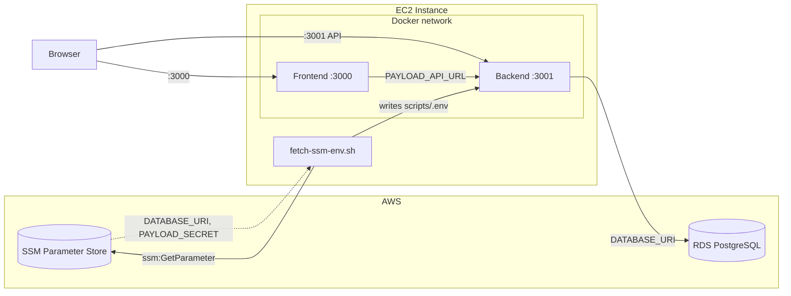

# Plan: Payload + RDS PostgreSQL on EC2

## Goal

Run the Payload workspace (frontend + backend) in Docker containers on an EC2 instance, connected to the **shared RDS PostgreSQL** instance provisioned by `Github-Repo-AWS-SharedServices-Infra`. Credentials are fetched from **AWS SSM Parameter Store** — no local PostgreSQL container.

## Architecture

- EC2 IAM role grants `ssm:GetParameter` + `kms:Decrypt` — no credentials file needed.
- `scripts/fetch-ssm-env.sh` reads SSM paths `/{env}/{app}/db/uri` and `/{env}/{app}/payload/secret` and writes `scripts/.env`.
- No `postgres` container, no `postgres_data` volume.

## SSM Parameter paths (written by Terraform Lambda DB init)

| SSM Path | Env var | Description |
|---|---|---|
| `/{env}/{app}/db/uri` | `DATABASE_URI` | Full `postgresql://` URI |
| `/{env}/{app}/payload/secret` | `PAYLOAD_SECRET` | Payload CMS secret key |

## Implementation steps

### 1. SSM fetch script
- `scripts/fetch-ssm-env.sh`: reads `SSM_ENV`, `SSM_APP`, `AWS_REGION` from shell; calls `aws ssm get-parameter`; writes `scripts/.env`.

### 2. Compose and env
- `scripts/docker-compose.yml`: removed `postgres` service, `migrate` service (postgres-dependent), `postgres_data` volume. Backend reads `DATABASE_URI` and `PAYLOAD_SECRET` from env file.
- `scripts/.env.example`: removed postgres vars; documents SSM fetch workflow.

### 3. Scripts
- `scripts/up.sh`: calls `fetch-ssm-env.sh` first, then starts backend and frontend. No postgres/migrate steps.
- `scripts/migrate.sh`: removed postgres wait; uses `DATABASE_URI` from `.env` (RDS).

### 4. Docs
- `readme.md`, `commands.md`, `plan.md`, `change.md`, `CHECKLIST.md`, `prerequisites.md` updated.

## What we do not change

- No edits under `frontend/` or `backend/`.
- `scripts/backend-migrate.Dockerfile`, `scripts/frontend.Dockerfile`, `scripts/compose.frontend-image.yml`, `scripts/build-frontend-with-backend.sh`, `scripts/rebuild.sh` — unchanged.

## Status

- [x] Prerequisites script and docs in place
- [x] Docker Compose and PostgreSQL service added (local)
- [x] Backend service wired to PostgreSQL
- [x] Frontend service wired to backend
- [x] Commands and readme updated
- [x] **Removed local postgres container — backend now uses shared RDS via SSM credentials**
- [x] `scripts/fetch-ssm-env.sh` added
- [x] `scripts/docker-compose.yml` updated (no postgres service)
- [x] `scripts/.env.example` updated
- [x] `scripts/up.sh` and `scripts/migrate.sh` updated
- [x] All docs updated
